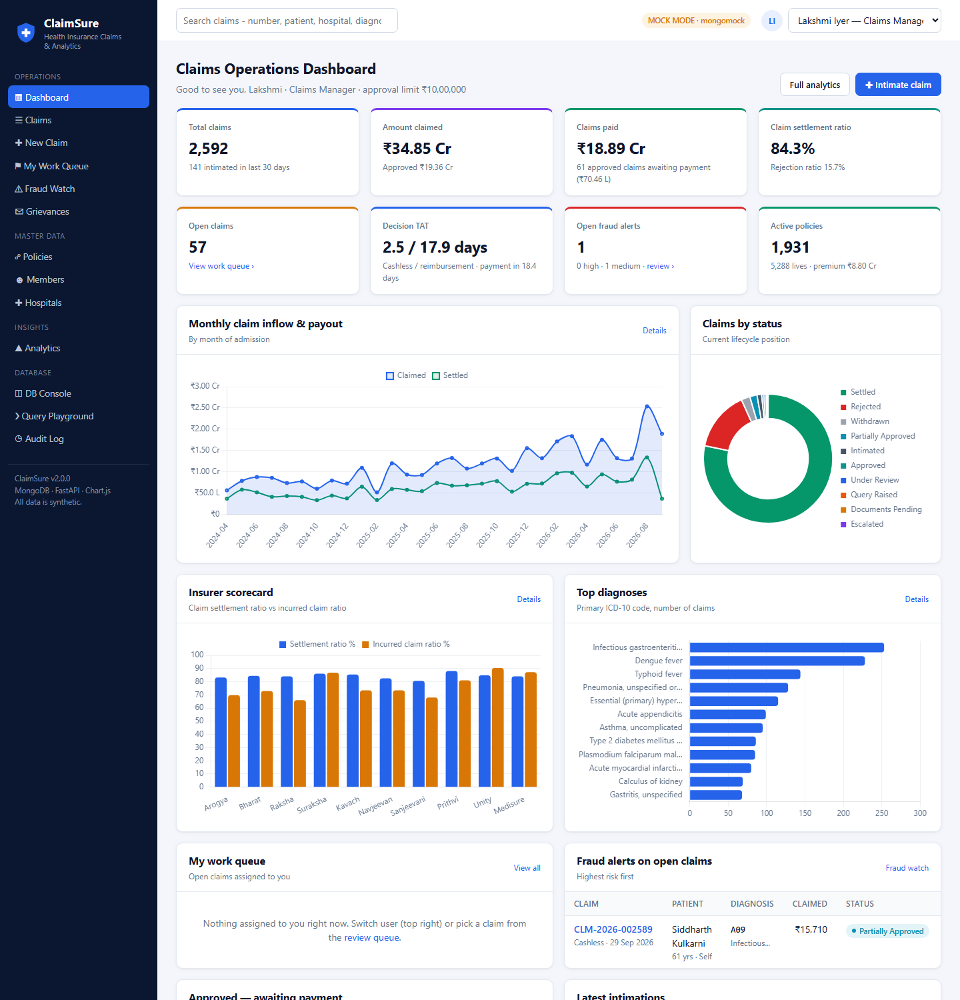
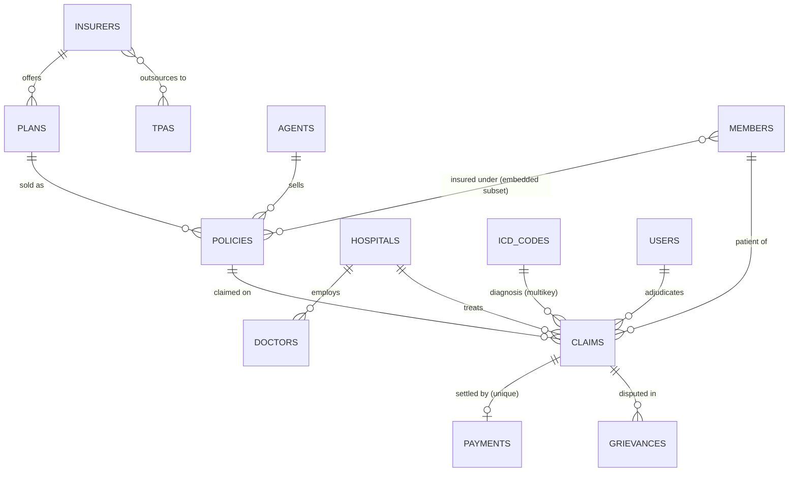
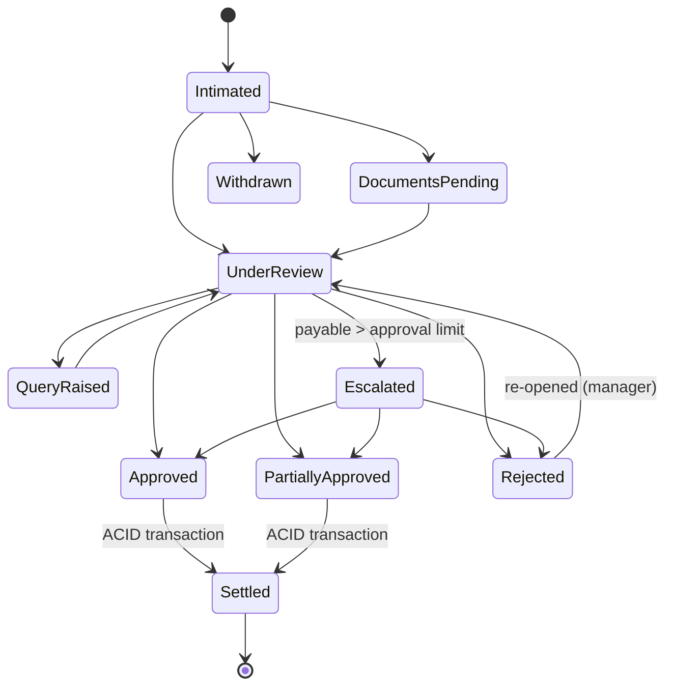

# ClaimSure: Health Insurance Claim Processing & Analytics System

ClaimSure is a NoSQL (MongoDB) system that runs the full life of a health insurance claim:

1. Intimation and pre-authorisation.
2. Document checks and adjudication against the policy wording.
3. Approval limits and escalation.
4. Settlement as a multi-document ACID transaction.
5. Fraud scoring, grievances and an audit trail.

On top of this sits an analytics layer of **19 aggregation pipelines**.

> **Course:** Database Management Systems &middot; **Database:** MongoDB &middot; **Stack:** Python 3, PyMongo, FastAPI, Jinja2, Chart.js
> All people, hospitals, insurers and companies in the data set are fictional.



---

## Highlights

| Area | What is implemented |
|---|---|
| **Data volume** | 16,863 documents in **14 collections**: 5,288 members, 2,200 policies, 2,592 claims, 99 hospitals, 484 doctors, 2,027 payments, 3,744 audit entries |
| **Schema design** | Embedding, references, the extended-reference, subset and computed patterns, bounded arrays, and a sequence (counter) collection |
| **Schema validation** | `$jsonSchema` validators on 14 collections (required fields, types, enums, regex patterns, min/max), defined once in `schema/validators.json` |
| **Indexes** | 50 secondary indexes (65 with the default `_id` indexes): unique, compound (ESR rule), multikey, **text**, **partial**, **sparse**, **TTL** and **2dsphere** |
| **Aggregation** | `$facet`, `$bucket`, `$lookup`, `$unwind`, `$group`, `$cond`, `$dateToString`; mongosh scripts add `$setWindowFields`, `$dateDiff`, `$percentile`, `$merge` and `$geoNear` |
| **Transactions** | Claim settlement updates `claims`, `policies`, `payments` and `audit_logs` atomically, with a "simulate failure" button that proves the rollback |
| **Business logic** | Adjudication engine (waiting periods, room-rent proportionate deduction, sub-limits, co-pay, sum-insured cap), approval-limit escalation, a 10-state claim workflow, fraud scoring with 9 red-flag rules |
| **Interfaces** | A web application with 15+ pages, an interactive CLI, 8 mongosh scripts and a REST/JSON API for the charts |
| **Quality** | 79 automated tests (`pytest`) covering data integrity, adjudication maths, fraud rules, workflow, transactions, analytics and every page |

---

## Quick start (no database installation needed)

```bash
pip install -r requirements.txt
python main.py web          # opens http://127.0.0.1:8000
```

By default ClaimSure runs in **mock mode**. It uses `mongomock`, an in-memory MongoDB, and loads the data set at start-up in about 3 seconds. Every feature works in mock mode. Transactions are emulated, validation runs in the application and query plans are simulated, and the UI labels each of these.

Other commands:

```bash
python main.py              # interactive console menu
python main.py report       # KPI summary + insurer / product / rejection reports
python main.py benchmark    # index benchmark
python main.py test         # run the 79 tests
python main.py generate     # regenerate data/*.json (deterministic)
```

Use the user switcher (top right) to act as different staff. A **Claims Executive** can approve up to ₹75,000, a **Senior Adjuster** up to ₹3 lakh and a **Claims Manager** up to ₹10 lakh. Anything above your limit is escalated automatically.

## Running on a real MongoDB (free)

MongoDB is free: use the **Community Server** locally or an **Atlas M0** cluster. Transactions need a replica set (Atlas always provides one).

```bash
# Local single-node replica set (one time)
mongod --replSet rs0 --dbpath ./mongo-data
mongosh --eval "rs.initiate()"

# Point ClaimSure at it
set CLAIMSURE_MONGO_URI=mongodb://localhost:27017/?replicaSet=rs0      # Windows
export CLAIMSURE_MONGO_URI="mongodb://localhost:27017/?replicaSet=rs0" # macOS / Linux

python main.py init-db      # validators + data + indexes on the server
python main.py web          # header now shows "LIVE · MongoDB"
```

With a real server the app uses native transactions, server-side `$jsonSchema` validation, true `explain("executionStats")` plans, `$text` search and `$near` geo queries.

### mongosh scripts (`scripts/`)

Run these from the project root, in order:

| Script | Shows |
|---|---|
| `01_create_collections.js` | Collections created with `$jsonSchema` validators read from `schema/validators.json` |
| `02_load_data.js` | Loads `data/*.json` with `EJSON.parse` and initialises the counters |
| `03_indexes.js` | Builds all indexes from `schema/indexes.json` and proves the unique index stops a double payment |
| `04_crud.js` | Create (with an atomic counter), read (`$all`, `$elemMatch`, positional projection, `$lookup`), update (`$push`, `arrayFilters`, upsert), soft and hard delete |
| `05_aggregations.js` | `$facet`, `$setWindowFields` (running totals, moving average, `$rank`), `$dateDiff` with `$percentile`, `$lookup` with a sub-pipeline, `$merge` materialised view |
| `06_indexing_explain.js` | `explain("executionStats")` with and without an index (`hint({$natural:1})`), a covered query, `$indexStats` |
| `07_transactions.js` | Session transaction with commit, a forced abort with verification, and a refused double settlement |
| `08_geo_text_search.js` | `$geoNear` nearest network hospitals, `$geoWithin`, `$text` search with relevance score |

```bash
mongosh "mongodb://localhost:27017/?replicaSet=rs0" --file scripts/01_create_collections.js
```

> The scripts pass a JavaScript syntax check but have not yet been run against a live server. Run them once on your MongoDB before the final review.

---

## Data model



| Collection | Docs | Purpose | Notable modelling |
|---|---:|---|---|
| `insurers` | 10 | Insurance companies | IRDAI registration, solvency ratio |
| `tpas` | 6 | Third-party administrators | Many-to-many with insurers (id arrays) |
| `plans` | 35 | Products (Basic, Comprehensive, Senior, Premier, Group) | Embedded features, waiting periods, sub-limits |
| `icd_codes` | 55 | ICD-10 diagnosis master | Benchmark cost and stay used by fraud rules |
| `hospitals` | 99 | Hospitals across 26 cities | GeoJSON `location` (2dsphere), network insurer array |
| `doctors` | 484 | Treating doctors | Unique medical registration number |
| `members` | 5,288 | Insured people | KYC (masked), lifestyle, declared pre-existing conditions |
| `policies` | 2,200 | Policies in force or expired | **Embedded** `insured_members[]` (subset) and `renewal_history[]` |
| `claims` | 2,592 | The claim case file | Embedded bill, diagnosis, documents, queries, `status_history[]`, adjudication and fraud; `snapshot` extended reference |
| `payments` | 2,027 | Settlements | Unique on `claim_number`, so a claim can't be paid twice |
| `grievances` | 256 | Customer complaints | Linked to claims |
| `audit_logs` | 3,744 | Append-only change log | TTL index (3-year retention) |
| `users` / `agents` | 22 / 45 | Staff with approval limits; sales intermediaries | |

### Why embed or reference?

- **Embed** what is always read and written with its parent and is bounded in size. Examples are a claim's bill, deductions and status history, and a policy's insured members and renewal years. One read loads the whole case file, and one atomic update changes status and history together.
- **Reference** shared or unbounded data: members, hospitals, policies and payments.
- **Extended reference**: claims copy the patient name, age, hospital name, city and tier into `snapshot`. Lists render without `$lookup`, and history stays correct if the master record changes later.

---

## Claim lifecycle



### Adjudication engine (`claimsure/adjudication.py`)

1. **Eligibility:**
   - policy in force on the admission date
   - patient is an insured member
   - initial 30-day waiting period (accidents exempt)
   - maternity cover and waiting period
   - specific-illness waiting period (24 months)
   - pre-existing disease waiting period
   - exclusions
   - reviewer rejection (documents missing, fraud, not medically necessary)
2. **Financials:**
   - non-payable consumables and admin charges
   - room-rent cap (1% of sum insured or a room category), with the IRDAI **proportionate deduction** on associated charges
   - ambulance limit
   - disease sub-limits (e.g. cataract ₹40,000) and the maternity limit
   - co-payment (20% on senior plans)
   - available sum insured

The data generator uses the same engine, so every seeded amount is consistent.

### Fraud engine (`claimsure/fraud.py`)

Nine red-flag rules produce a 0–100 score (high risk is 60 or more):
- duplicate or overlapping stay
- inflated bill against the ICD benchmark
- early claim after inception
- frequent claimant
- watch-listed hospital
- inconsistent length of stay
- out-of-state planned treatment
- high-value non-network claim
- round-figure bill

The scan builds its context with bulk aggregation, not one query per claim.

---

## Project structure

```
claimsure/            core package (no web code)
  db.py               mock / real MongoDB connection
  schema.py           $jsonSchema loader + validator (mock mode)
  indexes.py          index creation, catalogue, explain-based benchmark
  seed.py             loads data/*.json, counters, indexes
  adjudication.py     policy rules engine
  fraud.py            fraud scoring
  services.py         workflow: intimation, status changes, decisions, settlement, grievances
  transactions.py     native session transactions / emulated rollback in mock mode
  analytics.py        19 aggregation-pipeline reports + $facet KPIs
  audit.py, constants.py, utils.py
web/                  FastAPI app, Jinja2 templates, CSS/JS, bundled Chart.js
schema/               validators.json, indexes.json  (shared by Python and mongosh)
data/                 the data set (MongoDB Extended JSON)
scripts/              mongosh scripts 01-08
tools/generate_data.py  deterministic data generator
tests/                pytest suite
main.py               CLI entry point
```

## Web application pages

| Page | What it does |
|---|---|
| Dashboard | KPIs (settlement ratio, turnaround time, open fraud alerts), charts, your work queue, claims awaiting payment |
| Claims | Filter, search, sort, paginate and export to CSV; shows the MongoDB query behind the page |
| Claim detail | Patient and policy, adjudication worksheet with eligibility checks and deductions, role-aware actions, fraud assessment, timeline, payment, audit |
| New claim | Policy lookup, network check, bill entry; validated, fraud-scored and audited |
| Policies / Members / Hospitals | Master data with drill-downs; nearest hospitals use `$near` (MongoDB) or haversine (mock) |
| Analytics | 19 reports, each with chart, data table and the exact aggregation pipeline |
| Fraud watch | Risk-ranked alerts, rule statistics, watch-listed hospitals, re-scan |
| Grievances / Audit log | Complaint handling and the full change history |
| DB console | Collections and sizes, data model, design patterns, index catalogue, validators, live demos |
| Query playground | Read-only `find` and `aggregate` with ready-made examples |

## Testing

```bash
python -m pytest -q tests        # 79 tests, about 25 s
```

## Team

- Nirupam

## License

MIT
